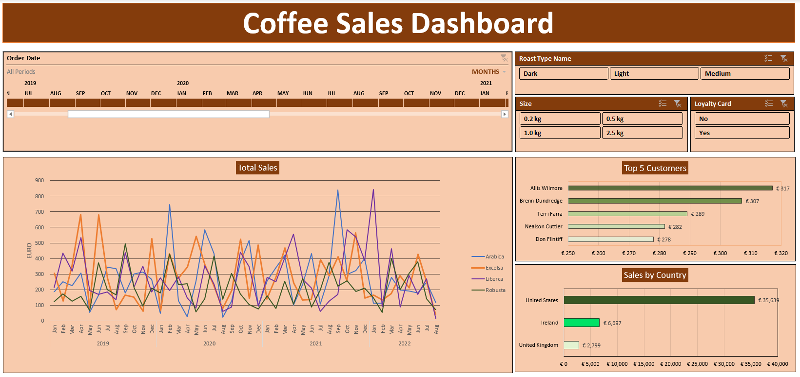

# Coffee Orders Analysis Project

## Project Overview
This project aims to analyze data related to coffee sales, customer demographics, and product performance. The dataset provides insights into customer purchasing behavior, product profitability, and sales trends across regions.

## Objectives
- Identify top-performing products based on sales and profitability.
- Analyze customer purchasing behavior by region and loyalty card usage.
- Develop insights into product preferences for different roast types and sizes.
- Create visualizations and dashboards for easier data interpretation.

## Tools and Technologies
- **Data Analysis**: Microsoft Excel (Pivot Tables, Charts, and Dashboards).
- **Data Visualization**: Excel charts for trends, regional sales, and product performance.

## Key Deliverables
1. **Pivot Tables**: Summarize sales data by product, region, and customer segmentation.
2. **Charts**: Visualize trends in coffee sales, profit margins, and customer loyalty behavior.
3. **Dashboard**: Provide an interactive summary of key sales metrics.
